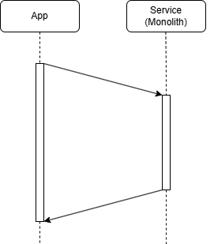
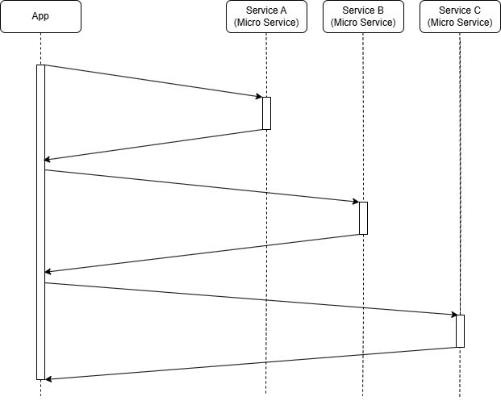
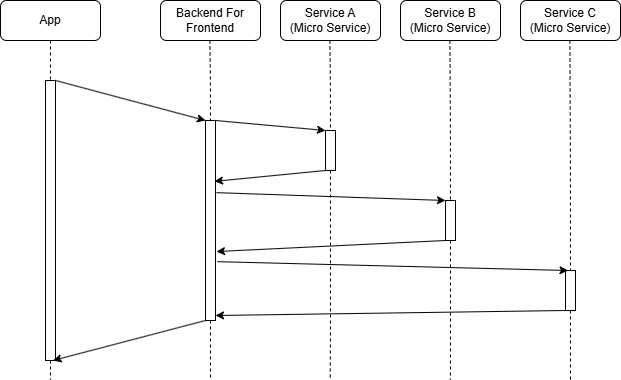
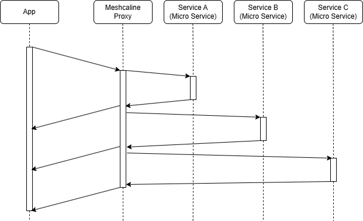

# Why Meshcaline Proxy?

The **Meshcaline Proxy** addresses the challenges introduced by distributed microservice architectures and offers an 
alternative to backend-for-frontend (BFF) architectures, which come with their own complexities.

## The Evolution of Web Service APIs

### The Early Days: Monolithic Web Services

Initially, web service APIs were built as **monoliths**, where a single system handled all business logic and provided 
individual endpoints for specific processes requested by their client applications.

These monoliths contained all the necessary capabilities to implement their business processes.

However, as businesses grew and processes became more complex, these monoliths became difficult to maintain, modify, and scale.

### The Rise of Microservices

The **microservice architecture** addresses monolithic limitations. Instead of a single, complex system, 
business processes are broken down into **self-contained** microservices, each responsible for a specific function. 
This results in:
- **Smaller, more manageable codebases**
- **Improved performance** by optimizing each service for its task
- **Greater reusability** of services across different business processes

However, a major drawback: **client applications now have to handle service orchestration.**

## The Challenges of Microservices for Clients

In a microservice-based system, client applications must **compose multiple service calls** to implement a 
business process. While developers are capable of handling this orchestration, it 
**introduces significant performance issues**, particularly for mobile applications.

### The Problem of Network Latency

In a monolithic system, a client might only need **one or a few requests** to the backend. In contrast, 
microservice-based architectures require **dozens of requests**, many dependent on previous responses. Given 
that these requests travel over the public internet, especially on mobile networks, 
**latency becomes the main bottleneck** rather than server processing times.

Network latency is **a fundamental limitation of physics**. The speed of light defines the upper limit -- for 
instance, it takes approximately **100ms** 
to transfer a single bit between Frankfurt and New York. No server optimization can overcome this physical constraint.

### The Problem of Over-Fetching Data

Microservices are often designed for **broader business domains**, not just a single client use case. As a result, 
they tend to **return more data than needed** in a specific context, wasting bandwidth and further increasing latency.

## Backend-For-Frontend: A Middle Layer Solution

To mitigate these issues, the **Backend-For-Frontend (BFF) pattern** emerged. A BFF service sits between the client 
and microservices, handling orchestration and filtering unnecessary data. Because BFFs are usually hosted 
**close to microservices**, they significantly reduce network latency.

 

### The Downsides of BFFs

While BFFs solve latency and over-fetching problems, they introduce new challenges:
1. **Development Bottlenecks** – Client teams depend on BFF teams to implement new functionality, leading to delays.
2. **API Design Misalignment** – BFF APIs often diverge from the microservice APIs they rely on, 
  making updates difficult and requiring costly redesigns.
3. **Scalability Issues** – Over time, maintaining and evolving a BFF architecture becomes complex as more 
  microservices and business processes are introduced.

### GraphQL: A More Flexible Alternative?

GraphQL, becoming popular around 2015, allows to address some of the BFF limitations by allowing clients to 
**query only the data they need** using a standardized query language. However, it comes with its own drawbacks:
- Clients **lack visibility** into how queries are processed, sometimes leading to performance bottlenecks.
- GraphQL requires a **global type system**, often conflicting with evolving microservice data models.

## Introducing Meshcaline Proxy

The **Meshcaline Proxy** provides a flexible and scalable alternative to BFFs by acting as a 
**lightweight orchestration layer** rather than a separate API.

### How Meshcaline Proxy Works

Instead of a dedicated service maintained by a separate team, Meshcaline Proxy is a 
**generic infrastructure component** that:
- **Orchestrates multiple web service calls** based on instructions provided by the client.
- **Filters unnecessary data** before sending the response back to the client.
- **Keeps the client in control**, avoiding the rigidity of BFF implementations.
- **Enables responsive UI**, by streaming individual sub-resources independently

Unlike GraphQL, Meshcaline Proxy does **not enforce data model transformations**, allowing microservices to evolve 
independently while still optimizing client responses.

## Is This the End of BFFs?

**Not necessarily, but Meshcaline Proxy eliminates the need for many BFF use cases.**

When BFFs are used for **business logic separation**, they remain valuable. However, if the main reason for a BFF 
is **reducing latency and optimizing client requests**, Meshcaline Proxy is a **more efficient and 
scalable alternative**.

### Complementing BFFs with Meshcaline Proxy

Even in cases where a BFF is needed, Meshcaline Proxy can **enhance its capabilities**:
- **Maintains clean, client-agnostic business logic** in the BFF.
- **Optimizes request orchestration based on client needs**, without modifying the BFF itself.

## And there is more...

### Beyond Proxied Microservices: External Orchestration

Meshcaline Proxy can orchestrate calls to **external services** beyond microservices within a company. For example:
- A service returns an address.
- The client needs geolocation coordinates.
- The proxy can automatically fetch data from **Google's Geocoding API** and combine the results.

Because the proxy operates on a **high-speed data center network**, it can complete this task much faster than a
client device, reducing latency.

### Implicit support for Meshcaline API design principles
Webservice API that follow the [Meshcaline hypertext-control design](https://meshcaline.org/basics/#hypertext-controls)
are implicitly supported and 
dramatically simplify the orchestration instructions that the client has to send. Rather then being forced to
specify how to construct a subrequest given the information returned in the previous response, the client just has to
indicate which hypertext controls to follow and the proxy will construct the subrequest automatically.

## Conclusion

The move from monolithic to microservices architectures introduced new challenges in **client-side orchestration 
and performance optimization**. While BFFs emerged as a solution, they introduced bottlenecks and rigid dependencies.

**Meshcaline Proxy provides a lightweight, flexible, and scalable alternative**, allowing client applications to 
efficiently compose microservices without the downsides of traditional BFF architectures.

